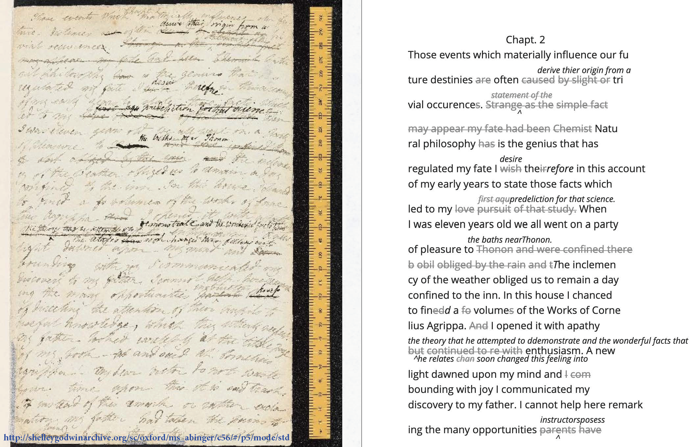
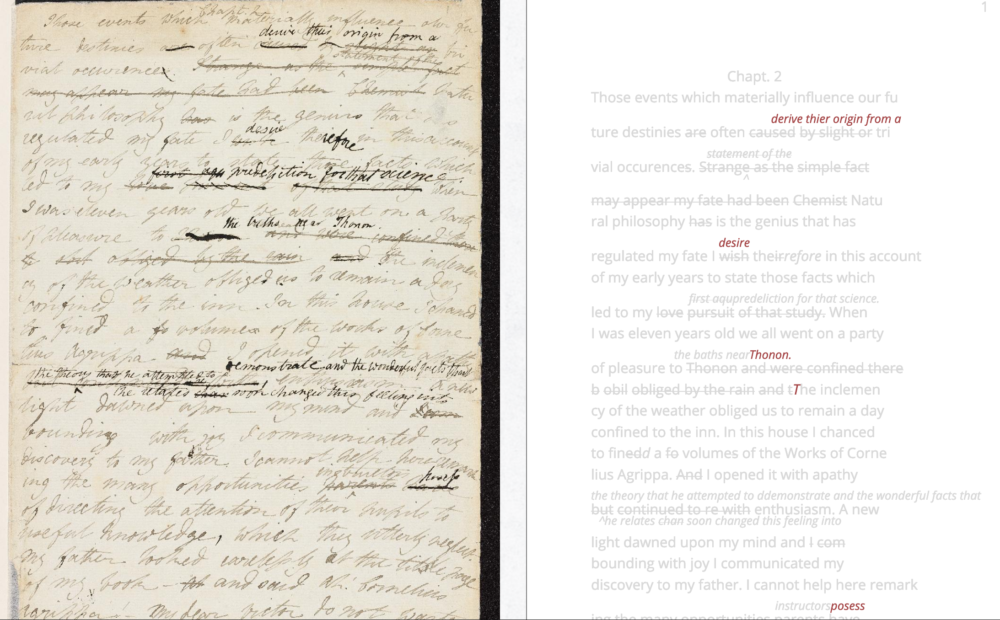

[<<<Previous  ](what_is_xml.md)  [Next>>>](basic_architecture.md)

# Modules and Modeling

## What is the TEI Consortium?

The Text Encoding Initiative is run by a group of people that collectively develops and maintains the standard, called the [Consortium](https://tei-c.org/). This group publishes a set of Guidelines which specify encoding methods for texts in humanities, social sciences and linguistics. 

As I said before, the structure of TEI is modular, and the guidelines are organized into 23 modules. Each module specifies a specific type of text encoding, based on the type of document you want to encode. There are also explanatory modules that explain the basic architecture and function of TEI, as well as how to implement the guidelines. They address everything from representing verse, to dictionaries, to graphs and networks. The full list of modules consist of the following: 

    1 The TEI Infrastructure
    2 The TEI Header
    3 Elements Available in All TEI Documents
    4 Default Text Structure
    5 Characters, Glyphs, and Writing Modes
    6 Verse
    7 Performance Texts
    8 Transcriptions of Speech
    9 Dictionaries
    10 Manuscript Description
    11 Representation of Primary Sources
    12 Critical Apparatus
    13 Names, Dates, People, and Places
    14 Tables, Formulæ, Graphics and Notated Music
    15 Language Corpora
    16 Linking, Segmentation, and Alignment
    17 Simple Analytic Mechanisms
    18 Feature Structures
    19 Graphs, Networks, and Trees
    20 Non-hierarchical Structures
    21 Certainty, Precision, and Responsibility
    22 Documentation Elements
    23 Using the TEI

Within each module, you will find specific guidelines and explanations for that particular type of encoding. They also provide the necessary information for customizing your own TEI schema. As you can see, the guidelines are *extensive* and present a steep learning curve for anyone who wants to fully understand the TEI framework. 

## Primary Source Module

Thankfully, you don't have to know all of the guidelines to use TEI. For this workshop specifically, we will be working with a subset, *[The Represenation of Primary Sources](https://www.tei-c.org/release/doc/tei-p5-doc/en/html/PH.html)*, listed under Module 11. 

Even within this module, things can quickly get complicated. As anyone familiar with textual scholarship or editing knows, there are many approaches to the digitization and transcription of texts. A diplomatic transcription, for example, which attempts to render visual elements of manuscripts as they appear on the page, differs greatly from a critical edition, which exercises editorial intervention to create an authoritative or definitive text. Without going too much into editorial theory, suffice it to say that this module is robust enough to be used toward both kinds of projects. 

Our focus, within the Primary Source module, is on *the diplomatic transcription of manuscripts*. This means that we will focus on a relatively small subset of tags that work to identify and render manuscript elements. For an example of this kind of encoding, refer to the below image from the [Shelley-Godwin Archive](http://shelleygodwinarchive.org/), which provides an archive the digitized manuscripts of Percy Shelley, Mary Shelley, William Godwin, and Mary Wollstonecraft. 

The image shows TEI in all its glory. On the left side, there is an image of the manuscript page (actually, the first page of the manuscript for Mary Shelley's novel, *Frankenstein*). On the right side, there is the *diplomatic transcription*, which renders the textual elements on the page in readable form. You can see the strikethroughs and the addtions on this transcription and, depending on your familiarity with Mary Shelley's script, you will have an easier time decyphering what they say. 

Pretty cool right? But this isn't all that TEI can do. Thanks to the tagging structure, which not tags *not only* how elements might appear but also their *content* or the *identity of the writer*, we can also get a sense of whose writing appears in this manuscript. 

Some background information: as Mary Shelley wrote this story, her husband, Percy Shelley, revised it, adding his own deletions and additions in the interlinear spaces. With the TEI, the editor can tag the areas where Mary Shelley was drafting, and the areas where Percy Shelley intervened. Below you will see Percy Shelley's contributions emphasized in red: 

Due to the tagging schema, the editors where able to indicate the sections of the manuscript where Percy's writing often overwrote Mary's. 

## Elements

Let's take a closer look at how they might have done this with TEI. The sections that are crossed out are marked as "deleted" with the **&lt;del>** tag. This is the shorted "del", enclosed within angle brackets, **&lt;** and **>**. The shortened word and its angle brackets form the anatomy of what we call an *element* in TEI. They would be implemented as a tag that encloses the deleted text, with the second tag including a backslash **/** to indicate it's a closing tag. The element, complete with the text it defines, is encoded like the following:

    <del>This is deleted text</del>

The actual deleted text goes insie of the &lt;del> tags. And you must always include both an opening and closing tag, or the computer won't know the bounds of the deleted text. 

In addition to elements, TEI also contains *attributes*, or classes that further describe certain elements. These qualify the element in some way, such as specifying how it should be rendered, using the *rend* attribute, for example. The attribute is always accompanied by a value that defines that attribute. If you want your deleted text to appear with a strikethrough, you would encode it the following way:

    <del rend="strikethrough">This is striked out text</del>

Notice a couple of things--first, the attribute followed by an equal sign, and its value is enclosed by quotation marks. This is standard form for defining the values of an attribute. If you were to use another value, say, *align*, instead of *strikethrough*, that would also have to be precended by an equal sign and enclosed by quotation marks. 

You can begin to see how TEI, like many programming languages, is driven by strict rules and hierarchies. There is no room for mistakes here, everything has to be flawlessly typed out and enclosed within the parent elements. A missing quotation mark would likely corrupt the entire file, preventing it from being rendered until you fix the bug.  

## Technical → Theoretical

The &lt;del> element is an key element in the Primary Source module of the guidelines. It is important to recognize how the specific elements within each module reinforce a certain approach toward textual encoding. Marking up a text is a *modeling activity*, in that it instantiates a certain interpretation of the textual data. In this way, the technical practice leads to a theoretical intervention. 

As the WWP explains, 
    “The most significant concepts of text encoding, from a scholarly standpoint, are not the technical details but rather the broader ideas about modelling textual information, representational strategies, and editorial method: in fact, the same domain that has been the province of scholarly editing for centuries. What needs to be grasped is how these ideas translate into the digital medium, and what changes when they do.”

Markup reveals what the encoder thinks are the necessary or hidden aspects of the text. It is, therefore, an interpretation. By modeling the text, one expresses their own editorial approach, manifesting their own reading of the text. In this way, TEI is a tool for scholarly research. 

[<<<Previous  ](what_is_xml.md)  [Next>>>](basic_architecture.md)